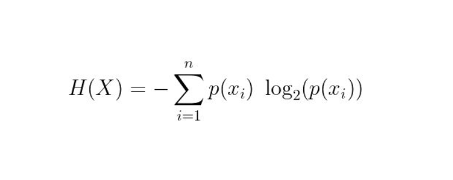

➡️ In Shannon's entropy, which generally occurs in information theory and ML, we're trying to find the number of bits that are required to fully determine the state of a random variable. Consider the example of tossing three coins. 'H' represents heads and 'T' represents tails on the visible side of the coin. With logic, we know beforehand that the number of states possible (or the number of configurations of the coins) are eight (HTH, HHT, HTT, ...).

➡️ To determine the state of any sample, we would first ask a yes/no question - 'Is the first coin a heads?'. The answer reveals what the first coin was. Next, we ask 'Is the second coin a heads?' which reveals the second coin and likewise, after the third question we precisely determine the triplet of coins that was achieved after the experiment.

➡️ For a random variable that can have 8 possible states, we had to ask 3 yes/no questions. Each yes/no question indicates a bit, so we need 3 bits to encode the state of the random variable. The number of bits equals log2( 8 ) = 3 = -log2(1/8) which is seen in the expression of entropy below. We calculate the number of states for each possible value of the random variable x_i and take a weighted average (where weights are their relative probabilities of occurrence) we get the average no. of bits needed to encode a state.

In ML, we wish to optimize our models for a more deterministic output, like the one-hot encodings provided as labels to the model. The avg. number of bits required to transform the model's outputs (called logits) to a desired output is computed with cross-entropy. Lower the cross entropy, the nearer we are to the desired outcome, hence less number of bits are required.